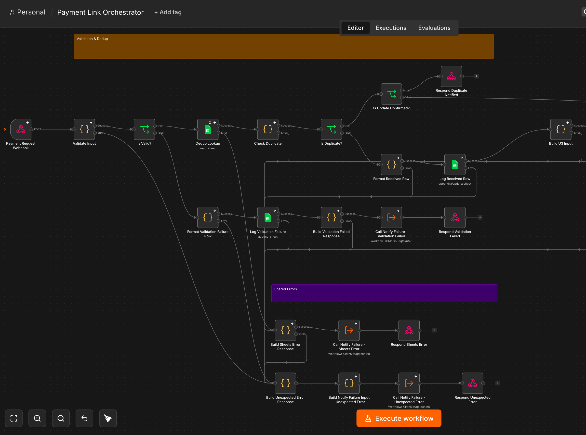
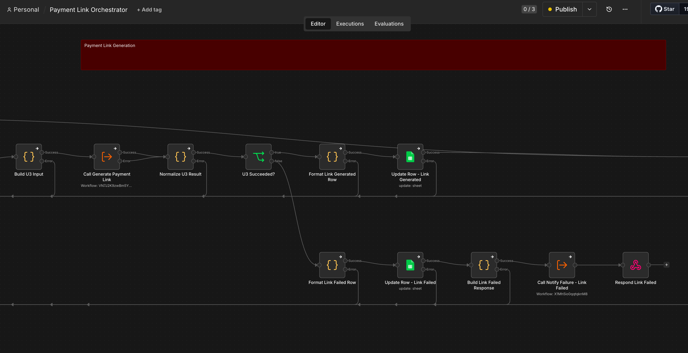
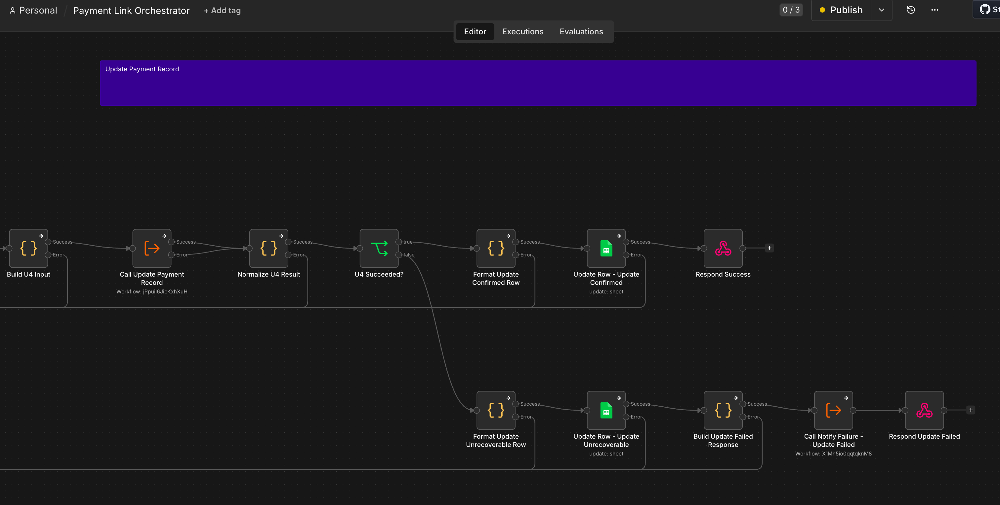
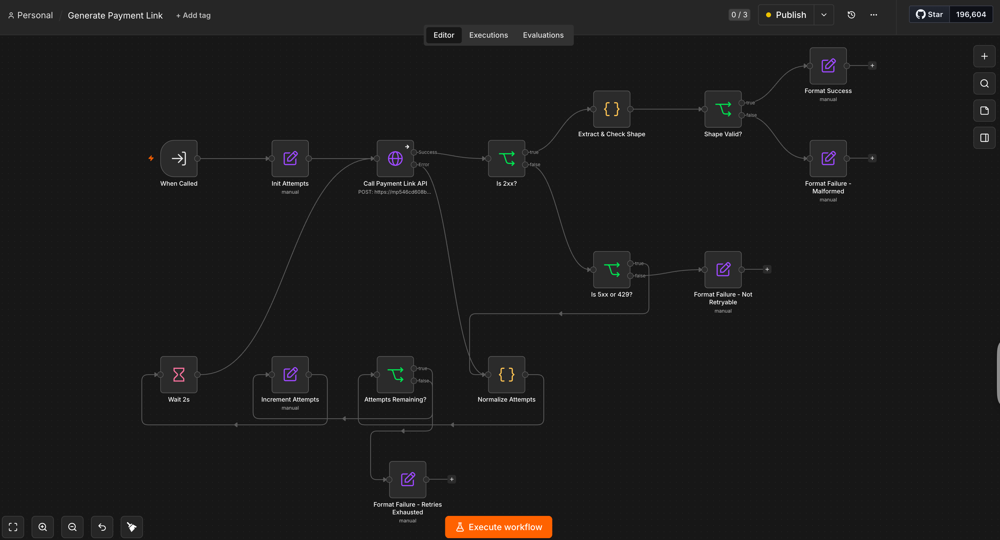
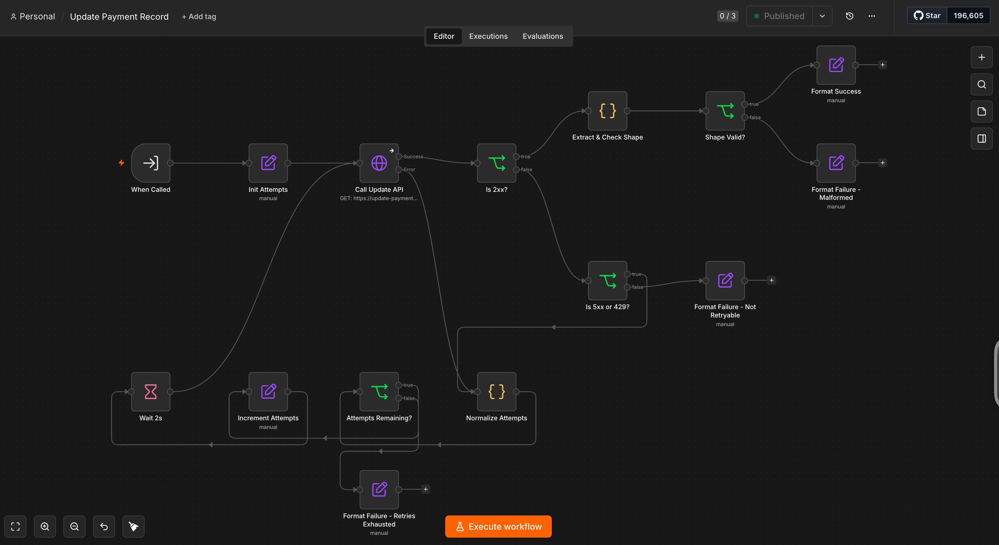

# Payment Link Generation Workflow

## Overview

A modular n8n workflow that receives a payment request via webhook, generates a payment link through an external Payment Link API, and updates the payment record through an external Update API — with conditional retry handling, deduplication, and a full audit trail.

---

## User Story

As a dealership admin, I want to generate a shareable payment link for a customer directly from our system, so that I can collect payment without a manual, ad-hoc workaround — and know for certain whether the link was created and the payment record updated, even if the payment gateway or a downstream service is temporarily unavailable.

---

## Assumptions & Design Decisions

- **Modular sub-workflows** — `Generate Payment Link` and `Update Payment Record` each own their retry policy and are independently reusable, called from the orchestrator.
- **Retry classification** — retries only fire when trying again could produce a different outcome: a server hiccup, a dropped connection, a temporary overload (up to 3 attempts). A request the gateway rejects outright is never retried, since it would just fail the same way again. Mirrors Stripe's/Razorpay's retry guidance. The API returns a machine-readable code per failure type — see `testcases.md` for the full list.
- **Dedup key** — `referenceId`, checked against the audit Sheet before any external call, mirroring the idempotency-key convention Stripe/Razorpay document. It's a local check only, never forwarded to the Payment Link API as an idempotency token. `invoiceNumber` has no bearing on dedup; a new invoice needs a new `referenceId`.
- **Audit trail** — every outcome is a row in a dedicated Google Sheet, keyed by `referenceId`, with per-phase status columns rather than one field overwritten at each step.
- **Alerting** — Slack fires for validation failures, unrecoverable link/update failures, audit-log write failures, and the workflow-wide crash catch-all. Not for routine duplicate/replay hits — those aren't operational problems.
- **Auth** — the webhook requires a shared-secret header, rejected before any workflow logic runs.
- **Mock API behavior** — the Payment Link API's real response omits a couple of documented fields. Both sub-workflows tolerate either shape and fall back to the caller's own `referenceId` when it's missing. The Update API matches its documented shape.
- **GET-with-body** — the Update API's documented contract works against the mock, but is fragile in general: some infrastructure (e.g. a load balancer) rejects a body on GET before the application ever sees it.
- **Slack URL via environment variable** — no credential type in this n8n instance can hold a bare URL usable directly in a node field, so the alert URL is an env var instead of a stored credential.

---

## Architecture

Three n8n workflows: two independent, reusable sub-workflows and one orchestrator that ties them together.

```
Source system
   │ POST (shared-secret header)
   ▼
Orchestrator
   ├─ validate required fields
   ├─ dedup lookup by referenceId
   ├─ Generate Payment Link  (sub-workflow → Payment Link API, retries transient failures)
   ├─ Update Payment Record  (sub-workflow → Update API, retries transient failures)
   └─ one synchronous response
```

### Main Orchestrator, section by section

#### Validation & Dedup



| Outcome | Trigger | What happens | Alert |
|---|---|---|---|
| Validation passed | All required fields present & well-formed | continues to link generation | none |
| Validation failed | Missing/malformed field(s) | rejected immediately, no processing | Slack |
| Duplicate — already completed | Same request already fully processed | existing link returned, nothing re-run | none |
| Duplicate — partially completed | Link was generated but the record update never confirmed | skips link generation, retries only the record update | depends on outcome |
| Not a duplicate | Nothing meaningful completed on a prior attempt | fully reprocessed from scratch | n/a |
| Audit log unavailable | The audit Sheet can't be read or written | request fails, nothing is silently lost | Slack |
| Unexpected crash | Any unanticipated internal error | request fails safely instead of exposing a raw error | Slack |

#### Payment Link Generation



| Outcome | Meaning | What happens |
|---|---|---|
| Link generated | Payment Link API succeeded | continues to record update |
| Rejected | Gateway declined the request outright — retrying wouldn't help | fails immediately, no retry |
| Malformed response | Gateway returned success but an unusable response | fails immediately, no retry |
| Temporarily unreachable | Connection issue, still unresolved after retries | fails after 3 attempts |
| Gateway unavailable | Gateway itself erroring, still unresolved after retries | fails after 3 attempts |
| Sub-workflow crash | Internal error instead of a clean result | fails safely, flagged distinctly from a gateway failure |

#### Update Payment Record



Same failure modes as link generation. One difference: a failure here still surfaces the already-generated `payment_link`, since that part already succeeded.

| Outcome | What happens |
|---|---|
| Update confirmed | Success — response includes the payment link |
| Update unrecoverable | Failure — response still includes the payment link |

### Sub-workflows

Both sub-workflows share the same conditional-retry state machine; only the target API differs.

#### Generate Payment Link



#### Update Payment Record



| State | Condition | Next action |
|---|---|---|
| 2xx + valid shape | Response has the required fields | Format Success → return `{success: true, data}` |
| 2xx + malformed shape | Response is missing required fields | Format Failure - Malformed (non-retryable) |
| 4xx | Non-retryable client error | Format Failure - Not Retryable |
| 5xx / 429, attempts remaining | Retryable, under the 3-attempt bound | Wait 2s → retry |
| 5xx / 429 / connection error, attempts exhausted | Retryable, but 3 attempts used up | Format Failure - Retries Exhausted |

---

## Bonus: Slack Alerting

Every operationally-relevant failure also pushes a Slack notification, not just an audit-log row someone would have to go looking for.

- **What triggers an alert** — a validation failure, an unrecoverable Payment Link or Update API failure, an audit-log write failure, and the workflow-wide crash catch-all.
- **What doesn't** — routine duplicate/replay hits. Those are expected behavior, not incidents.
- **Implementation** — a single reusable `Notify Failure` sub-workflow, called from every failure branch. Each caller builds its message from the same outcome shown in the API's own failure response, so the Slack alert and the caller's response never disagree.
- **Why an Incoming Webhook** — a plain HTTP request, no Slack app install or OAuth scopes needed.

---

## Project layout

```
payment-link-generator-assignment/
├── assignment.pdf
├── README.md
├── PLAN.md
├── testcases.md
├── images/
│   ├── orchestrator-validation-dedup.png
│   ├── orchestrator-link-generation.png
│   ├── orchestrator-update-record.png
│   ├── subworkflow-generate-payment-link.png
│   └── subworkflow-update-payment-record.png
└── workflows/
    ├── generate-payment-link.json      # Sub-workflow: Payment Link API + retry
    ├── update-payment-record.json      # Sub-workflow: Update API + retry
    ├── notify-failure.json             # Shared Slack-alert sub-workflow
    └── payment-link-orchestrator.json  # Main workflow: intake → response
```

---

## Prerequisites

- A running n8n instance (self-hosted; Community plan is sufficient — this design avoids the paid-only Variables feature).
- Credentials configured in n8n (Settings → Credentials):
  - **Header Auth** credential for the Payment Link API (`token` header).
  - **Header Auth** credential for the Update API (`token` header).
  - **Header Auth** credential holding a random shared secret, used as the webhook's own auth.
  - **Google Sheets OAuth2** credential, for the audit log.
- A dedicated Google Sheet for the audit log, with a header row of exactly these 19 columns (order matters for `autoMapInputData`): `referenceId, validation_status, link_generation_status, record_update_status, final_status, payment_link, payment_id, invoiceNumber, customerName, customerEmail, customerPhone, contactId, paymentAmount, currency, description, expire_by, created_at, updated_at, error_detail`. The three `_status` columns are per-phase checkpoints; `final_status` is the terminal outcome used for dedup bucketing.
- A Slack Incoming Webhook URL for the alerting bonus feature.
- n8n started with two environment variables exported in its shell (see Setup & execution).

---

## Request Parameters

| Field | Required | Type | Notes |
|---|---|---|---|
| `referenceId` | Yes | string | Unique idempotency key for this request |
| `paymentAmount` | Yes | number | Must be positive |
| `currency` | Yes | string | 3-letter uppercase code (e.g. `INR`) |
| `customerEmail` | Yes | string | Must be a valid email address |
| `invoiceNumber` | Yes | string | |
| `contactId` | No | string | |
| `customerName` | No | string | |
| `customerPhone` | No | string | 7-15 digits, optional leading `+` |
| `description` | No | string | |
| `expireBy` | No | number | Unix timestamp; must be in the future and no more than 3 years out. Defaults to 7 days if omitted |

A request missing any required field, or with a malformed optional field, fails validation immediately with no retry.

---

## Setup & execution

*(Technical — skip ahead to Known Limitations if you're just here for the product story.)*

1. **Import the four workflow JSON files** into n8n (Workflows → Import from File), in any order.
2. **Wire credentials**: open each imported workflow and attach the credentials listed above to the relevant nodes.
3. **Point the Google Sheets nodes** at your own audit spreadsheet's ID.
4. **Point the `Execute Workflow` nodes** in the orchestrator at your own imported copies of `Generate Payment Link`, `Update Payment Record`, and `Notify Failure`.
5. **Start n8n with these environment variables exported first** — required because Slack's webhook URL is read via `$env` (n8n blocks env-var access in expressions by default):
   ```bash
   export SLACK_WEBHOOK_URL="https://hooks.slack.com/services/..."
   export N8N_BLOCK_ENV_ACCESS_IN_NODE=false
   n8n start
   ```
6. **Activate all four workflows** (they call each other via Execute Workflow, which requires the target to be active).
7. **Test**: POST to the orchestrator's webhook URL with the documented payload shape and the shared-secret header.

### Happy path example

A fresh, valid request for a `referenceId` never seen before:

```bash
curl -X POST http://localhost:5678/webhook/payment-link \
  -H "Content-Type: application/json" \
  -H "X-Webhook-Secret: <your shared secret>" \
  -d '{
    "referenceId": "TS1989",
    "contactId": "CONT_10001",
    "customerName": "Amit Sharma",
    "customerPhone": "+919876543210",
    "customerEmail": "amit.sharma@example.com",
    "invoiceNumber": "INV_10234",
    "paymentAmount": 1000,
    "currency": "INR",
    "description": "Payment for service order INV_10234"
  }'
```

1. Validation passes (`validation_status: validation_passed`).
2. No existing row for `referenceId: TS1989` — treated as new.
3. `Generate Payment Link` returns a `payment_link`; audit row updated (`link_generation_status: link_generated`).
4. `Update Payment Record` confirms the update; audit row updated (`record_update_status: update_confirmed`, `final_status: update_confirmed`).
5. Response:
   ```json
   {
     "success": true,
     "referenceId": "TS1989",
     "status": "Payment link generated and record updated",
     "data": { "payment_link": "https://api.xyz.com/v1/payment_links/123456" }
   }
   ```

More scenarios (validation errors, duplicate handling, gateway failures, malformed requests) are in `testcases.md` as ready-to-run curl commands.

---

## Known Limitations & Production Considerations

- **The Google Sheets dedup/audit mechanism has a race window.** The dedup lookup and the row write aren't atomic, so two near-simultaneous requests for the same `referenceId` could both pass the dedup check. Would need an atomic conditional write to close.
- **No async reconciliation sweep for process-level crashes.** Recovery is workflow-level (in-request retries) only. A crash right after an external call succeeds but before returning would leave a misleading audit row with no automatic correction.
- **`referenceId` is the sole idempotency key, with no mismatch-conflict check.** A resend with different field values (e.g. a changed `paymentAmount`) isn't detected as a conflict — the original stored `payment_link` is returned and the new values are silently discarded.
- **Retry timing is a flat interval (3 attempts, 2s wait), not exponential backoff.**
- **`payment_link` is relayed to the customer with only a field-presence check**, not a URL-shape/domain validation.
- **Free-text fields (`customerName`, `description`) are only presence/shape-checked, not sanitized** — a leading `=`/`+`/`-`/`@` could trigger spreadsheet formula execution if the audit Sheet is opened in Excel/Sheets.
- **The audit Sheet's access/retention policy is undocumented** beyond "same Google account access as this n8n instance." No stated sharing boundary or deletion policy for the customer PII it accumulates.
- **No secrets are hardcoded** in any node parameter — API tokens, the webhook shared secret, and OAuth credentials are all n8n-managed; the one exception (Slack's webhook URL) is an environment variable, never a hardcoded value.

---

## Future Enhancements

- An async reconciliation sweep (scheduled companion workflow) to catch process-level crashes the in-request retries can't cover.
- A stricter idempotency check that rejects a resend carrying different field values under the same `referenceId`, instead of silently discarding them.
